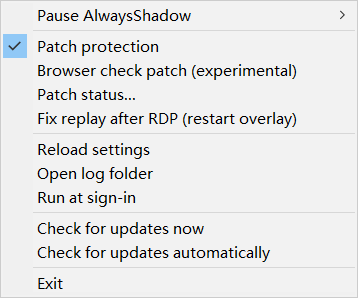
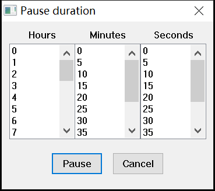
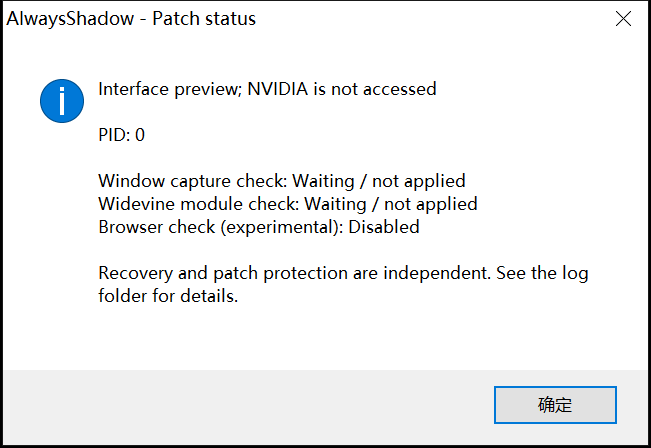

# AlwaysShadow + ShadowPlay Patcher

English | [简体中文](README.zh-CN.md)

Keep NVIDIA Instant Replay available with automatic recovery and the patch engine adapted from ShadowPlay Patcher 2.0, in one Windows tray application.

AlwaysShadow detects when Instant Replay turns off and retries the NVIDIA controls. Patch protection addresses the checks that can cause it to turn off in the first place. Both follow the same pause, whitelist and Windows session rules.

[Source](https://github.com/Ja5onVV/AlwaysShadow-ShadowPlay_Patcher) · [Releases](https://github.com/Ja5onVV/AlwaysShadow-ShadowPlay_Patcher/releases) · [Issues](https://github.com/Ja5onVV/AlwaysShadow-ShadowPlay_Patcher/issues)

## Features

- Automatic replay recovery that pauses during remote/unavailable capture and resumes after physical keyboard/mouse input at the PC.
- The 2.0 patch engine: export hooks, signature scanning, built-in defaults and saved per-user configuration, per-patch status, automatic reapplication when the NVIDIA target restarts, and restoration.
- An experimental browser check patch that is **off by default** and can be enabled separately.
- Timed or indefinite pause, process whitelist and exclusive-game rules.
- A tray menu positioned beside the clicked icon, including monitors with negative coordinates, keyboard activation and DPI scaling.
- Chinese or English menus selected from the Windows display language.
- Sign-in startup, an administrator restart option, and direct access to patch status and logs.

## Getting started

Requires **64-bit Windows 10/11**, a compatible NVIDIA GPU and NVIDIA App or GeForce Experience with its overlay enabled.

1. Download `AlwaysShadow.exe` from the repository's Releases page, or build this checkout using the instructions below.
2. Place the executable in its permanent folder. Settings are stored for the current Windows user; no adjacent configuration file is created or required.
3. Enable the NVIDIA overlay, configure its Instant Replay toggle shortcut, and check that Instant Replay can be enabled manually.
4. Run `AlwaysShadow.exe` and open its system tray menu. **Patch protection** is enabled by default; **Patch status…** shows the target PID and individual patch results.
5. If the target cannot be opened, choose **Restart as administrator…**. Automatic replay recovery remains separate from patch success.
6. Optionally enable **Run at sign-in** after placing the program in its permanent folder.

A normal, non-administrator launch uses the current user's Windows Run entry for sign-in startup. Enabling startup from an elevated instance creates an interactive, highest-privilege scheduled task for that user. To upgrade an existing ordinary startup entry, restart as administrator, turn **Run at sign-in** off, then on again.

If the Windows notification area is not ready at sign-in, AlwaysShadow keeps running and retries its tray icon once per second. It also restores the icon when Explorer recreates the taskbar.

If Windows switches keyboard languages when recovery runs, change NVIDIA's toggle shortcut from `Alt+Shift+F10` to a combination such as `Ctrl+Shift+F10`, then select **Reload settings**.

## Screenshots

These are captures of the application's actual Windows menus and dialogs, generated with representative settings. The status dialog is in **interface preview mode** and does not show a patched NVIDIA process.

**Tray menu**



**Custom pause duration**



**Per-patch status**



## Patch protection

The executable includes these default patch definitions:

| Patch ID | Purpose | Default |
| --- | --- | --- |
| `display_affinity` | Hooks `USER32!GetWindowDisplayAffinity` in the target to bypass its window capture check. | Enabled, required |
| `module_enum` | Hooks `KERNEL32!Module32FirstW` in the target to bypass its Widevine module scan. | Enabled, required |
| `browser_detect` | Locates the browser-name check in `nvd3dumx.dll` using signatures and patches its entry point. | **Disabled**, optional, experimental |

The engine locates a ShadowPlay `nvcontainer.exe` in the **current Windows session**, preferring the SPUser command line and using capture modules as a fallback. It waits if the target is missing, inaccessible or ambiguous. The normal monitoring interval is two seconds; failed patch operations retry after about ten seconds.

Patches change the target process's memory, not NVIDIA files on disk. The engine checks existing code, saves original bytes, and refuses unknown export hooks or non-unique signature matches. Compatibility still depends on the Windows, NVIDIA App and driver versions; a successful build does not establish compatibility with every driver.

To use automatic recovery on its own, uncheck **Patch protection**. To opt into the browser patch, enable **Browser check patch (experimental)**. That choice is saved in the current user's registry, alongside the application's other preferences.

### Settings and upgrading

Patch configuration is stored in the `PatchConfig` value under `HKCU\Software\AlwaysShadow`. A fresh installation uses the embedded defaults. Menu changes persist across restarts and executable upgrades, including when the executable's folder is read-only. Copying just the EXE to another Windows account or PC uses that account's own settings.

If no saved patch configuration exists, an older `patches.json` beside the executable is validated and imported once. The import preserves patch switches, custom definitions and additional fields. A successful import is recorded in the log; the old file can then be removed. The application does not create, rewrite or delete that file. Import and save failures appear in **Patch status…** and the log without replacing the previous settings.

The [legacy configuration example](docs/patches.example.json) documents the supported import format:

- `enabled` selects each patch independently.
- `required` controls whether that patch's failure makes the overall check fail. Other successfully applied patches can remain active.
- `export_hook` entries specify a DLL, exported function, stub bytes and overwrite size.
- `signature_patch` entries specify a DLL, candidate signatures, replacement bytes and overwrite size. Signatures support `?`/`??` wildcards and must identify one unique executable address.
- The browser menu entry operates on the `browser_detect` ID. Keep that ID if you want to use the menu toggle.

**Reload settings** first restores the current patches, then validates the saved configuration. Invalid configuration or a failed restoration is reported in **Patch status…** and the log; the engine retains recovery records and retries. To reset patch settings, exit the application, remove any legacy `patches.json`, and delete only the `PatchConfig` registry value. The next launch uses the embedded defaults.

### Restoration

Turning off patch protection, pausing AlwaysShadow, matching a whitelist rule, leaving the allowed games or leaving the local interactive desktop triggers restoration. Normal exit also attempts restoration before the worker stops.

Original bytes for signature patches are retained in memory for the current run. After a crash, forced termination or a previous run that left a signature patch behind, those bytes may be unavailable. The engine reports a restoration failure instead of claiming success. Restarting the affected NVIDIA process, or rebooting Windows, clears its memory patches.

## Pause, whitelist and exclusive games

| Situation | Automatic replay recovery | Patch protection |
| --- | --- | --- |
| Local desktop, physical keyboard/mouse input confirmed, rules allow capture | Re-enables replay after about ten seconds of settling | Applies and monitors enabled patches |
| **Pause AlwaysShadow** | Stops sending replay commands; does not force replay off | Restores and pauses |
| A whitelisted process is running | Stops sending replay commands; does not force replay off | Restores and pauses |
| Exclusive rules exist, but no matching game is running | Turns replay off when possible | Restores and pauses |
| RDP, disconnected/locked session, or no physical input confirmed | Stops commands and waits for physical PC use | Restores and waits |
| Replay fails to start or switches off during Sunlogin/other remote control | Pauses recovery until fresh physical keyboard/mouse input | Restores and waits |
| **Patch protection** is unchecked | Continues following the rules above | Restores and stays off |

Create `Whitelist.txt` beside `AlwaysShadow.exe`. Each ordinary line matches a process's complete command line, including quotes and arguments. In Task Manager's **Details** tab, enable the **Command line** column to find the value.

A line can start with `??<flags> `: two question marks, one or more flags, and a space. Matching is case-sensitive.

| Flag | Meaning |
| --- | --- |
| `E` | An exclusive rule: allow replay only while at least one exclusive process is running. A whitelist match takes priority. |
| `S` | Match a substring rather than the entire field. |
| `N` | Match the executable name rather than its command line. |
| `I` | Ignore this line; useful for comments. |

Example:

```text
??I Pause recovery and protection while this process is running
??N Netflix.exe
??I Allow replay only while Hades.exe is running
??EN Hades.exe
```

Use process names from your own PC. A background process also counts as running. After creating, editing or deleting the file, select **Reload settings**. If a process query fails or times out, AlwaysShadow pauses the rule-dependent work until a later successful poll.

## Recovery after remote access

AlwaysShadow enables replay only after confirming input at the physical PC. At startup and after RDP, disconnection or locking, return to the PC, sign in or unlock the **same Windows account**, and move its mouse or press its keyboard. After about ten seconds for NVIDIA to settle, the controls are reloaded and replay can start. A remote disconnect, unlock notification, display change, unpause or settings reload cannot substitute for physical input.

Sunlogin and similar tools can share the console desktop without Windows session notifications. Raw input and the complete device ancestry verify USB, Bluetooth and built-in keyboards/mice. Synthetic input and software virtual keyboards/mice cannot release the wait; virtual device activity also revokes existing confirmation. A background remote-control service does not have to exit. Unverifiable devices do not grant confirmation; if using only touch, virtual input or an unrecognized device, use a local USB/Bluetooth keyboard or mouse to resume.

If replay unexpectedly switches off, or remains off about ten seconds after an enable attempt, recovery pauses, patches are restored, and **fresh physical input** is required. Brief ON states no longer clear the attempt history; replay must remain on for thirty seconds to count as stable. There are no periodic enable retries while waiting, including during remote control.

Manual pause, whitelist and exclusive rules still take priority. Signing out closes AlwaysShadow; **Run at sign-in** starts it again at the next login. The program does not start an overlay that is disabled in NVIDIA's settings.

## Language

The menu, pause dialog and patch status summary follow the current user's Windows display language: all Chinese language variants select Simplified Chinese; other languages select English. Diagnostic details from the engine may remain in English.

An optional command-line override applies to that launch:

```powershell
.\AlwaysShadow.exe --language=zh
.\AlwaysShadow.exe --language=en
```

## Building and verification

Install [MSYS2](https://www.msys2.org/), then use its **MINGW64** shell:

```bash
pacman -S --needed make git mingw-w64-x86_64-gcc \
  mingw-w64-x86_64-pkgconf mingw-w64-x86_64-curl mingw-w64-x86_64-libsystre
git clone https://github.com/Ja5onVV/AlwaysShadow-ShadowPlay_Patcher.git
cd AlwaysShadow-ShadowPlay_Patcher
make -j4
make test
```

The output is `bin/AlwaysShadow.exe`. Builds and releases do not generate or copy a runtime configuration file. The build uses GCC for C, G++ with C++20 for the patch engine, and static linking. The current version comes from the main branch's `VERSION` file; building and testing require neither GitHub CLI nor network access. Saved user settings are preserved when rebuilding.

The ten test programs cover recovery timing, Windows session guards, physical/virtual input detection, replay controls and whitelist queries, menu localization and coordinates, tray startup retries and Explorer recreation, Release update checks and numeric version comparison, configuration persistence and migration, the patch engine, and its integration lifecycle. Settings tests use an in-memory registry; hook tests use scratch memory or test fixtures. They do not access saved user settings, patch NVIDIA, change sign-in startup, alter the Windows session or send keyboard input. Verify actual replay and patch behavior separately on the NVIDIA hardware and driver you use.

To inspect the real UI without starting recovery, opening NVIDIA processes or saving settings:

```powershell
.\bin\AlwaysShadow.exe --preview --language=zh
```

To regenerate the README screenshots on an unlocked local Windows desktop:

```bash
make screenshots
```

This developer tool captures its own native windows into `docs/screenshots/`. It is not a screenshot-saving feature in the regular application.

## Publishing

Update `VERSION`, commit the source, and push the matching tag (`v2.3` for version `2.3`) to GitHub. With GitHub CLI authenticated, create and review the draft, then publish it:

```bash
make release release_notes=path/to/notes.md
make publish
```

The release targets build and test the executable and require a clean checkout matching the tag. Publishing the Release makes the update discoverable; no separate version branch or historical tag list is used.

## Files and troubleshooting

| Location | Contents |
| --- | --- |
| Beside the executable: `Whitelist.txt` | Optional process rules |
| `%LOCALAPPDATA%\AlwaysShadow\output.log` | Recovery and patch diagnostics; open via **Open log folder** |
| `HKCU\Software\AlwaysShadow` | Patch configuration, browser/protection switches and update preferences |
| Windows Run entry or task `AlwaysShadow-<user SID>` | Optional sign-in startup |

If **Patch status…** keeps waiting, check that the overlay is enabled, try enabling Instant Replay manually, and use the administrator restart option if access is denied. If a signature is missing or ambiguous after a driver update, leave the experimental browser patch off and inspect the log. For recovery failures, also check the configured shortcut and active pause/process rules.

**Check for updates now** reads the latest stable GitHub Release and compares its numeric version with the version embedded in the executable (`v2.10` is newer than `v2.9`; an equal or older release is not an update). If the API is rate limited, it resolves GitHub's public latest-Release page instead, without requiring a login. It can open that Release's page; updates are not installed automatically. Network failures and invalid responses are reported as failed checks, not as confirmation that the program is current.

To uninstall, disable **Run at sign-in** first, choose **Exit**, then delete the application folder. If you registered an elevated startup task, use an elevated instance to remove it. Settings and logs can be removed separately if desired.

## Credits and license

- [Verpous/AlwaysShadow](https://github.com/Verpous/AlwaysShadow): original tray application and replay recovery.
- [furyzenblade/ShadowPlay_Patcher](https://github.com/furyzenblade/ShadowPlay_Patcher): original patch research and export-hook approach.
- [DrKet/ShadowPlay_Patcher-2.0](https://github.com/DrKet/ShadowPlay_Patcher-2.0): the engine used as the integration base.
- [cJSON](https://github.com/DaveGamble/cJSON): the JSON parser already included by AlwaysShadow.

See [LICENSE](LICENSE) and [patch engine provenance](src/patcher/UPSTREAM.md). The embedded cJSON source retains its license notice. This project is not affiliated with NVIDIA.
