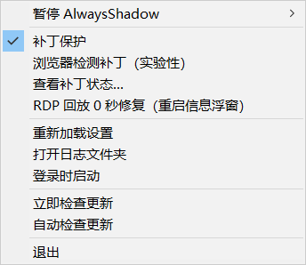
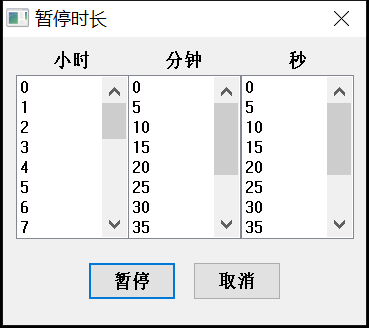
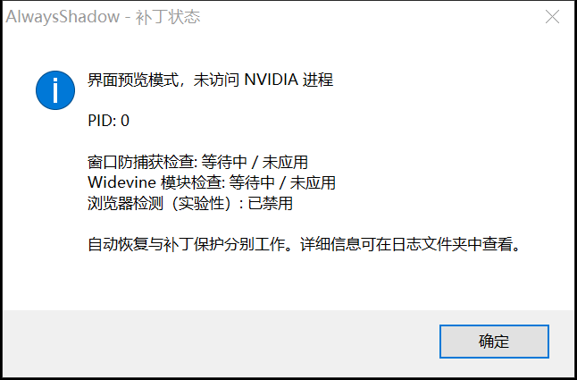

# AlwaysShadow + ShadowPlay Patcher

[English](README.md) | 简体中文

将即时回放自动恢复与 ShadowPlay Patcher 2.0 补丁引擎集成到一个 Windows 托盘程序中，帮助保持 NVIDIA 即时回放可用。

AlwaysShadow 检测即时回放被关闭的情况，并通过 NVIDIA 控制接口或快捷键尝试恢复；补丁保护则处理可能导致即时回放被关闭的检测逻辑。两者共同遵守暂停、白名单和 Windows 会话规则。

[项目源码](https://github.com/Ja5onVV/AlwaysShadow-ShadowPlay_Patcher) · [发布页面](https://github.com/Ja5onVV/AlwaysShadow-ShadowPlay_Patcher/releases) · [问题反馈](https://github.com/Ja5onVV/AlwaysShadow-ShadowPlay_Patcher/issues)

## 主要功能

- 自动恢复即时回放；远控或录制不可用时暂停，回到物理机操作本机键鼠后再恢复。
- 集成 2.0 补丁引擎：导出函数 Hook、特征码扫描、内置默认规则和按用户保存的配置、逐项状态、NVIDIA 目标进程重启后自动重打补丁，以及补丁还原。
- 浏览器检测补丁可独立开关，属于实验性功能，**默认关闭**。
- 定时暂停、手动恢复、进程白名单和限定游戏规则。
- 托盘菜单在点击位置附近弹出，处理负坐标显示器、键盘呼出和 DPI 缩放。
- 根据 Windows 显示语言自动选择中文或英文菜单。
- 登录时启动、以管理员身份重新启动、补丁状态和日志入口。

## 开始使用

需要 **64 位 Windows 10/11**、兼容的 NVIDIA 显卡，以及已开启覆盖功能的 NVIDIA App 或 GeForce Experience。

1. 从项目发布页面下载 `AlwaysShadow.exe`，或按下文说明编译当前源码。
2. 将 EXE 放到固定位置。设置按当前 Windows 用户保存，不需要也不会在程序旁生成配置文件。
3. 在 NVIDIA 设置中开启覆盖功能，设置即时回放切换快捷键，并确认能够手动开启即时回放。
4. 运行 `AlwaysShadow.exe`，打开系统托盘菜单。**补丁保护**默认启用，**查看补丁状态…**可查看目标 PID 和各项结果。
5. 如果无法访问目标进程，选择**以管理员身份重新启动…**。自动恢复与补丁是否成功分别工作。
6. 将程序放到固定位置后，可勾选**登录时启动**。

普通权限下开启登录自启，会使用当前用户的 Windows Run 注册表项；管理员权限下开启，则创建仅在该用户登录时运行、使用最高权限的计划任务。如果之前已设置普通自启，先以管理员身份重新启动，再取消并重新勾选**登录时启动**，即可切换。

登录时如果 Windows 通知区域尚未就绪，AlwaysShadow 会继续运行，每秒重试创建托盘图标；Explorer 重建任务栏后也会自动恢复图标。

如果自动恢复导致 Windows 切换输入语言，可将 NVIDIA 的切换快捷键从 `Alt+Shift+F10` 改为 `Ctrl+Shift+F10` 等组合，然后选择**重新加载设置**。

## 功能截图

以下截图直接来自程序使用的 Windows 原生菜单和对话框，展示代表性的设置。补丁状态窗口处于**界面预览模式**，不代表已对 NVIDIA 进程应用补丁。

**托盘菜单**



**自定义暂停时长**



**逐项补丁状态**



## 补丁保护

EXE 内置以下默认补丁规则：

| 补丁 ID | 作用 | 默认设置 |
| --- | --- | --- |
| `display_affinity` | Hook 目标进程中的 `USER32!GetWindowDisplayAffinity`，跳过窗口防捕获检查。 | 启用、必需 |
| `module_enum` | Hook 目标进程中的 `KERNEL32!Module32FirstW`，跳过 Widevine 模块扫描。 | 启用、必需 |
| `browser_detect` | 通过特征码定位 `nvd3dumx.dll` 中的浏览器名称检查，并修改其函数入口。 | **关闭**、可选、实验性 |

引擎只在**当前 Windows 会话**中寻找 ShadowPlay 的 `nvcontainer.exe`，优先识别 SPUser 命令行，录制相关模块作为后备依据。目标缺失、权限不足或候选不唯一时会等待。正常检查间隔为两秒，补丁操作失败后约十秒重试。

补丁修改目标进程内存，不修改磁盘上的 NVIDIA 文件。引擎会检查现有代码、保存原始字节，并拒绝覆盖未知 Hook 或不唯一的特征码匹配。兼容性仍取决于 Windows、NVIDIA App 和驱动版本；编译成功不等于兼容所有驱动。

如果只需要自动恢复，可取消勾选**补丁保护**。需要尝试浏览器补丁时，单独勾选**浏览器检测补丁（实验性）**；此选择与程序的其他偏好一起保存在当前用户的注册表中。

### 设置保存与升级

补丁配置保存在 `HKCU\Software\AlwaysShadow` 下的 `PatchConfig` 值中。首次使用时读取 EXE 内置的默认规则，菜单修改会跨重启和 EXE 升级保留，程序目录只读也可以保存设置。只复制 EXE 到其他 Windows 账户或电脑时，使用目标账户自己的设置。

如果还没有保存过补丁配置，程序会校验并一次性导入 EXE 旁旧版的 `patches.json`，保留补丁开关、自定义规则和附加字段。导入成功会记录在日志中，之后可删除旧文件。程序不会创建、改写或删除该文件。导入或保存失败时，会在**查看补丁状态…**和日志中提示，并保留原有设置。

[旧版配置示例](docs/patches.example.json) 说明支持导入的格式：

- `enabled`：独立启用或禁用每个补丁。
- `required`：该补丁失败时，是否将整体检查标记为失败；其他已经成功应用的补丁可能继续生效。
- `export_hook`：指定 DLL、导出函数、替代代码字节和覆盖长度。
- `signature_patch`：指定 DLL、候选特征码、替换字节和覆盖长度。特征码支持 `?` / `??` 通配符，必须定位到唯一的可执行地址。
- 菜单中的浏览器开关对应 `browser_detect` ID；如需保留该开关，请保留这个 ID。

**重新加载设置**时，先还原当前补丁，再校验已保存的配置。配置无效或还原失败时，会在**查看补丁状态…**和日志中报告；引擎保留还原记录并继续重试。如需恢复默认补丁设置，先退出程序，移除旧版 `patches.json`，再只删除注册表中的 `PatchConfig` 值；下次启动会使用内置默认规则。

### 补丁还原

关闭补丁保护、暂停 AlwaysShadow、白名单命中、不再有符合限定规则的游戏运行，或离开本地交互桌面时，会触发还原。正常退出时也会先尝试还原，再停止工作线程。

特征码补丁的原始字节仅保存在本次运行的内存中。崩溃、强制结束或上一次运行遗留补丁后，原始字节可能无法取得；程序会报告还原失败，不会将其显示为成功。重启受影响的 NVIDIA 进程，或重启 Windows，可清除对应的内存补丁。

## 暂停、白名单和限定游戏

| 情况 | 即时回放自动恢复 | 补丁保护 |
| --- | --- | --- |
| 本地桌面可用，已确认本机键鼠输入，规则允许 | 等待约十秒后按需开启即时回放 | 应用并检查已启用的补丁 |
| **暂停 AlwaysShadow** | 停止发送控制命令，不强制关闭已经开启的即时回放 | 还原并暂停 |
| 白名单进程正在运行 | 停止发送控制命令，不强制关闭已经开启的即时回放 | 还原并暂停 |
| 已设限定规则，但没有匹配的游戏运行 | 在可以控制时关闭即时回放 | 还原并暂停 |
| RDP、断开或锁定，或尚未确认本机键鼠输入 | 停止控制，等待本机物理操作 | 还原并等待 |
| 向日葵等远控中即时回放开启失败或自动关闭 | 暂停自动恢复，直到再次操作本机键鼠 | 还原并等待 |
| 取消勾选**补丁保护** | 继续遵守以上规则自动恢复 | 还原并保持关闭 |

在 `AlwaysShadow.exe` 旁创建 `Whitelist.txt`。普通行匹配进程的完整命令行，包括引号和参数。可在任务管理器的**详细信息**页开启**命令行**列，查看需要填写的内容。

每行可使用 `??<标志> ` 前缀：两个问号、一个或多个标志字符，再加一个空格。匹配区分大小写。

| 标志 | 含义 |
| --- | --- |
| `E` | 限定规则：只有至少一个匹配进程运行时才允许即时回放；白名单命中优先。 |
| `S` | 子串匹配，而非完整字段匹配。 |
| `N` | 匹配可执行文件名，而非命令行。 |
| `I` | 忽略该行，可用于注释。 |

示例：

```text
??I Pause recovery and protection while this process is running
??N Netflix.exe
??I Allow replay only while Hades.exe is running
??EN Hades.exe
```

请按自己电脑上的实际进程名填写。后台进程也算运行中。创建、修改或删除该文件后，选择**重新加载设置**。如果进程查询失败或超时，程序会暂停依赖这些规则的操作，等待后续查询成功。

## 远控结束后恢复

AlwaysShadow 只在确认本机物理操作后自动开启即时回放。程序启动时，以及 RDP、会话断开或锁屏后，都需要回到物理机，用**同一个 Windows 账户**登录或解锁，再移动本机鼠标或按一下本机键盘。随后等待约十秒让 NVIDIA 初始化，再重新加载控制信息并尝试开启。仅断开远控、解锁通知、显示器变化、取消暂停或重新加载设置，都不会代替本机输入确认。

向日葵等软件可能共享本地桌面，不发送 Windows 会话通知。程序通过原始输入和设备的完整父级链核验 USB、蓝牙及内置键鼠；模拟输入和软件虚拟键鼠不能解除等待，检测到虚拟键鼠活动还会撤销本机确认。检测依据是实际输入，无需退出常驻的远控服务。设备来源无法核验时会保持等待；仅有触控、虚拟输入或无法识别的键鼠设备时，可使用本机 USB/蓝牙键鼠确认。

如果即时回放意外关闭，或一次开启尝试后约十秒仍未开启，程序会立即暂停后续恢复、还原补丁，并等待**新的本机键鼠操作**。短暂的“开启”状态不会清空失败记录，连续稳定录制三十秒才视为恢复成功。远控期间不会每隔几秒或三十秒循环发送开启快捷键；回到本机操作后才会再试。

手动暂停、白名单和限定游戏规则始终优先。注销会关闭 AlwaysShadow，勾选**登录时启动**可在下次登录时重新运行。程序不会代替用户开启 NVIDIA 设置中已经关闭的覆盖功能。

## 界面语言

托盘菜单、暂停对话框和补丁状态摘要根据当前用户的 Windows 显示语言自动选择：中文语言区域统一显示简体中文，其他语言显示英文。引擎的技术诊断详情可能保留英文。

也可通过命令行临时指定本次启动的语言：

```powershell
.\AlwaysShadow.exe --language=zh
.\AlwaysShadow.exe --language=en
```

## 编译与验证

安装 [MSYS2](https://www.msys2.org/)，打开其 **MINGW64** 终端：

```bash
pacman -S --needed make git mingw-w64-x86_64-gcc \
  mingw-w64-x86_64-pkgconf mingw-w64-x86_64-curl mingw-w64-x86_64-libsystre
git clone https://github.com/Ja5onVV/AlwaysShadow-ShadowPlay_Patcher.git
cd AlwaysShadow-ShadowPlay_Patcher
make -j4
make test
```

生成文件为 `bin/AlwaysShadow.exe`，编译与发布流程不再生成或复制运行配置文件。C 代码使用 GCC，补丁引擎使用 G++ / C++20，最终采用静态链接。当前版本取自主分支的 `VERSION` 文件，编译与测试不需要 GitHub CLI 或网络。重新编译会保留已保存的用户设置。

十组测试覆盖恢复时序、Windows 会话保护、本机与虚拟键鼠识别、回放控制和白名单查询、菜单语言及坐标、托盘启动重试与 Explorer 重建、Release 更新检查与数字版本比较、配置保存与迁移、补丁引擎，以及集成生命周期。设置测试使用内存中的模拟注册表，Hook 测试只使用临时内存或测试函数；不会访问实际用户设置、修改 NVIDIA 进程、自启设置或 Windows 会话，也不发送键盘输入。实际录制效果与驱动兼容性仍需在使用的 NVIDIA 硬件上验证。

如需查看真实界面，但不启动恢复、不访问 NVIDIA 进程，也不保存设置：

```powershell
.\bin\AlwaysShadow.exe --preview --language=zh
```

在已解锁的本地 Windows 桌面上重新生成 README 截图：

```bash
make screenshots
```

此开发工具只截取自身创建的原生窗口，图片保存到 `docs/screenshots/`。日常运行的程序没有新增截图保存功能。

## 发布

修改 `VERSION`、提交源码，并将匹配的标签推送到 GitHub（版本 `2.3` 对应标签 `v2.3`）。登录 GitHub CLI 后，创建并检查草稿，再正式发布：

```bash
make release release_notes=path/to/notes.md
make publish
```

发布目标会编译并测试程序，并要求工作区干净、当前提交与标签一致。发布 Release 后程序即可发现更新，无需维护独立版本分支或历史标签列表。

## 文件位置与排查

| 位置 | 内容 |
| --- | --- |
| 可执行文件旁的 `Whitelist.txt` | 可选的进程规则 |
| `%LOCALAPPDATA%\AlwaysShadow\output.log` | 恢复与补丁诊断，可通过**打开日志文件夹**访问 |
| `HKCU\Software\AlwaysShadow` | 补丁配置、浏览器与保护开关、更新偏好 |
| Windows Run 项或 `AlwaysShadow-<用户 SID>` 计划任务 | 可选的登录自启 |

如果补丁状态一直等待，请确认覆盖功能已开启，尝试手动开启即时回放；权限不足时使用管理员重启选项。驱动更新后如出现特征码缺失或匹配不唯一，可保持实验性浏览器补丁关闭，并查看日志。自动恢复失败时，还应检查快捷键和当前暂停、进程规则。

**立即检查更新**会读取 GitHub 最新正式 Release，并与程序内置版本按数字比较（`v2.10` 高于 `v2.9`；相同或更旧的版本不算更新）。API 限流时会改为解析 GitHub 最新发行版页面的跳转地址，无需登录。检测到更新后可打开该发行版页面，不会自动安装。网络错误或无效响应会作为检查失败处理，不会误报“当前已是最新版本”。

卸载时，先取消勾选**登录时启动**，再选择**退出**，最后删除程序文件夹。如之前注册了管理员自启任务，请使用管理员权限运行程序后移除。设置和日志可按需另外清理。

## 致谢与许可

- [Verpous/AlwaysShadow](https://github.com/Verpous/AlwaysShadow)：原始托盘程序与即时回放恢复。
- [furyzenblade/ShadowPlay_Patcher](https://github.com/furyzenblade/ShadowPlay_Patcher)：原始补丁研究与导出函数 Hook 方案。
- [DrKet/ShadowPlay_Patcher-2.0](https://github.com/DrKet/ShadowPlay_Patcher-2.0)：本次集成使用的引擎基础。
- [cJSON](https://github.com/DaveGamble/cJSON)：沿用 AlwaysShadow 已包含的 JSON 解析库。

许可与来源见 [LICENSE](LICENSE) 和[补丁引擎来源说明](src/patcher/UPSTREAM.md)。内置 cJSON 源码保留其许可声明。本项目与 NVIDIA 无隶属关系。
